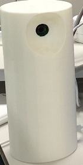
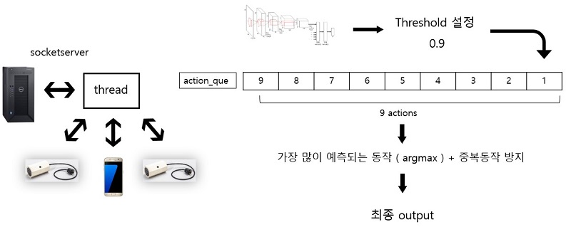

# 포스텍 정보통신연구소 3기 연구인턴 프로젝트

## J.A.R.V.I.S. Switch 

[Objectifier Spatial Programming](https://experiments.withgoogle.com/objectifier-spatial-programming)에서 영감을 받음

### 손동작으로 작동하는 인공지능 IoT

파이카메라를 통해 실시간으로 영상을 전달받은 PC(서버)가 손동작을 인식하고 해당 스위치에 ON/OFF 명령을 내린다.  ( Wifi 통신 )  

### [YouTube 시연 영상](https://youtu.be/gNL3EOQ2y9g)


## 동작 설명

### 가능한 동작 명령

##### 하나의 명령은 2가지 동작의 조합으로 이루어진다.

<table>
<tr>
<th>무드등을 켜줘(꺼줘)</th>
<th>가습기를 켜줘(꺼줘)</th>
<th>단축번호 1(2)번에 전화 걸어줘</th>
</tr>
</table><br>
 
예시 : &emsp;&emsp;&emsp;&emsp;&emsp;&emsp;&emsp; 가습기를 켜줘 &emsp;&emsp;&emsp;&emsp;&emsp;&emsp;&emsp;&emsp;&emsp;&emsp;&emsp;&emsp;&emsp;&emsp;&emsp;&emsp; 1번에 전화 걸어줘

&emsp;&emsp;

&emsp;&emsp;


### 세부동작

&emsp;&emsp;&emsp;&emsp; 무드등(LIGHT) &emsp;&emsp;&emsp;&emsp;&emsp;&emsp; 가습기(Humidifier) &emsp;&emsp;&emsp;&emsp;&emsp;&emsp;&emsp; 켜다(ON) &emsp;&emsp;&emsp;&emsp;&emsp;&emsp;&emsp;&emsp; 끄다(OFF)

&emsp;


&emsp;&emsp;&emsp;&emsp; 핸드폰(Phone) &emsp;&emsp;&emsp;&emsp;&emsp;&emsp;&emsp;&emsp; 1(One) &emsp;&emsp;&emsp;&emsp;&emsp;&emsp;&emsp;&emsp;&emsp;&emsp; 2(Two)

&emsp;


## 세부 구성

##### 라즈베리파이 기기 내부 구조

&emsp;&emsp;&emsp;&emsp;&emsp;&emsp;카메라&emsp;&emsp;&emsp;&emsp;&emsp;&emsp;&emsp;&emsp;&emsp;&emsp;&emsp;스위치(1, 2) - Relay 모듈&emsp;&emsp;&emsp;&emsp;&emsp;&emsp;&emsp;&emsp;&emsp;&emsp;&emsp;3D프린터

&emsp;


##### 안드로이드


## handpose estimation (손 인식 프로그램)

#### 오픈소스 활용 [Convolutional Pose Machines - Tensorflow](https://github.com/timctho/convolutional-pose-machines-tensorflow)

0 - 20번까지 21개의 point가 존재하며 각각 2차원(x,y)로 표현된다.


tracker 기능 : 손의 이동을 감지하고 손이 화면 내 어디에 위치하든 결과를 항상 고정된 공간 안에서 좌표로 표현한다.

## 프로그램 구조

### 전체적인 프로세스

실시간 구현을 위해 Queue와 Multi Thread 활용 | socketserver를 활용하여 다양한 기기 연결 확장 가능




### 적용 모델


## 프로그램 실행방법

#### 프로그램 환경

```
PC(서버) - Python 3.6 | Tensorflow 1.8.0 | opencv
라즈베리파이 - Ubuntu MATE
```

PC(서버) 실행 후 wait camera connection 문장이 나오면 카메라를 실행한다. ( 한 번 연결을 계속 유지해야 함)

스위치1, 스위치2, 안드로이드는 그 후 실행가능하며, 연결을 끊고 재접속이 가능하다. (socketserver)

```
PC(서버)  -  (opencv가 설치된 가상환경) python pred_origin.py
라즈베리파이_카메라  -  python3 picam.py 8003
라즈베리파이_스위치1  -  python3 client_switch1.py 9008
라즈베리파이_스위치2  -  python3 client_switch2.py 9008
```
